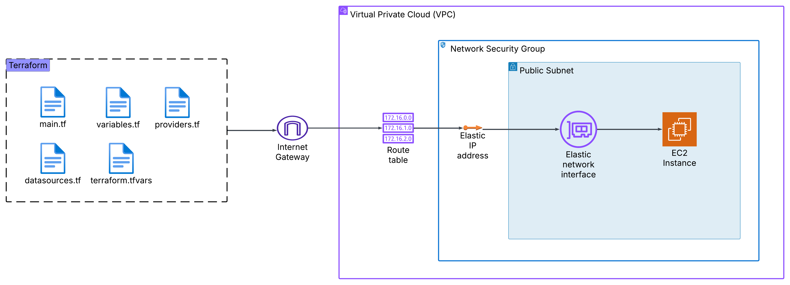

# Infrastructure as Code (IaC)

This project demonstrates the use of Terraform to provision an AWS infrastructure that includes a Virtual Private Cloud (VPC), Route Tables, EC2 instance, security groups, network interfaces, and Elastic IP address. The configuration automates the deployment of a secure and scalable environment, suitable for hosting web applications or services.

## Skills Demonstrated

## Terraform Configurations

* Writing declarative Terraform configurations to automate AWS infrastructure provisioning.
* Using modular Terraform files (`main.tf`, `variables.tf`, `providers.tf`, `datasources.tf`, `terraform.tfvars`).

## Networking in AWS

* Creating and configuring a VPC with a custom CIDR block.

* Defining subnets, route tables, and internet gateways.

* Associating a security group with an EC2 instance to enforce access control.

## Resource Management

* Provisioning an EC2 instance with a specific AMI and instance type.

* Attaching an Elastic IP to ensure a static public IP.

* Managing network interfaces (ENI) to improve flexibility in network configurations.

## Infrastructure Components

* VPC: Creates an isolated virtual network for our AWS resources.

* Subnet: Defines a logical subdivision of the VPC (configured as a public subnet).

* Internet Gateway: Allows internet access to resources within the VPC.

* Route Table: Configures routing rules for public traffic.

* Security Group: Defines firewall rules to control inbound and outbound traffic.

* Elastic Network Interface (ENI): Provides a virtual network interface for EC2.

* Elastic IP: Assigns a static, public IP to the EC2 instance.

* EC2 Instance: Deploys a virtual machine with a specified AMI and instance type.